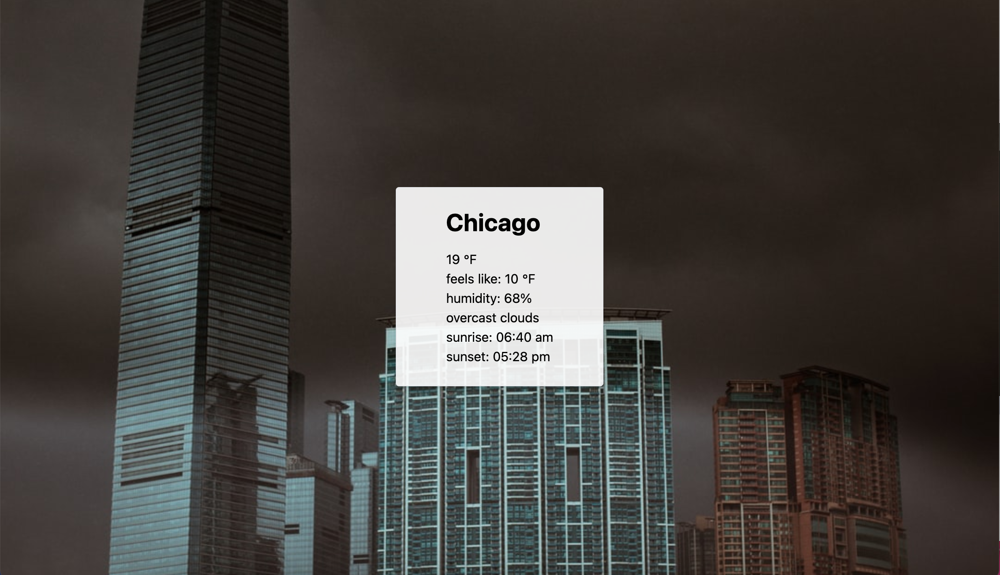

#React weather app in process 

ReactJS app to geolocate the user, return city, and display the current weather. The app also displays an unsplash image that uses the current weather condition as a search term. The app will auto-update every 10 minutes.

OpenWeather API
Google Maps Geocode API
Unsplash API
TailwindCSS styling

## screenshot
 

todo:
- [ ] separate component logic into multiple files, use redux
- [ ] refactor fetch() to axios
- [ ] toggle temps for F and C
- [ ] add spinner graphic (or similar) to account for load time
- [x] basic style
- [ ] find api or create styling based on weather conditions
- [x] display random unsplash image, not always first returned
- [x] screenshots in readme
- [ ] how to pull and use in readme
- [ ] deploy (netlify?)
- [ ] implement 10 day forecast
- [ ] display 0...images.length to return a different unsplash image each time 
- [ ] display "like this photo?" text so that people can link to unsplash images if they like
